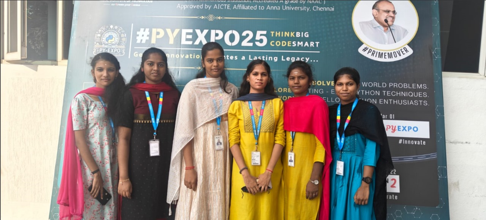
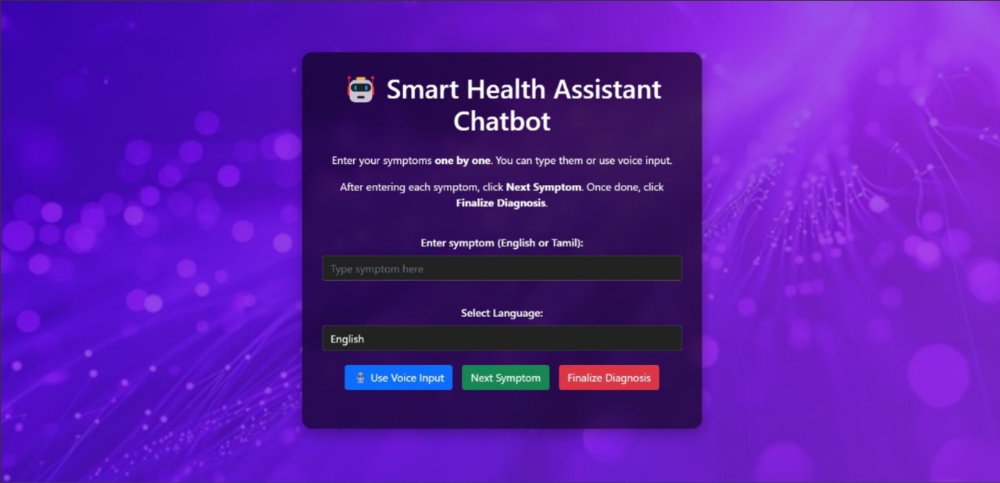

# TO54_HASHTECH  

---

## Problem Statement

Problem Statement ID – PY065

Formulate your problem statement clearly and concisely.
     Develop an intelligent healthcare chatbot to assist patients in comprehending symptoms.offering preliminary guidance, enhancing accessibility, streamlining consultations, and promoting 
    proactive well-being through an interactive, AI-driven conversational interface using NLP.
---

## Overview

Provide an overview of the project, its purpose, and what it aims to achieve along with proposed solution  
    Our AI-driven chatbot predicts diseases from  multiple symptoms, offers first-aid guidance through NLP,  multi-model validation, ensuring accuracy,under the guidance of HIPPA compilance,easy
    accessibility, and proactive healthcare assistance.

---

## Team Members

Team ID – T054

List your team members along with their roles.

- Miruthula Shree S - Team Leader(admin)
- Harini M          - Maintain
- Gomathi C         - Maintain
- Auslin Nausha R S - Maintain
- Janani T          - Maintain
- Akshayaa S A      - Maintain

---

## Technical Stack

List the technologies and tools used in the project. For example:

- Frontend: HTML, CSS, JavaScript
- *Backend:*python-Flask (Web Framework)
- Database: Firebase
- Other Tools: Git 

---

## Getting Started

Follow these steps to clone and run the application locally.

### Prerequisites

1. Install [Python](https://www.python.org/downloads/).
2. Install [Git](https://git-scm.com/).
3. Clone this repository:
   bash
   git clone https://github.com/username/repository-name.git
   

### Installation

1. Navigate to the project directory:
   bash
   cd repository-name
   
2. Create a virtual environment:
   bash
   python -m venv venv
   
3. Activate the virtual environment:
   - On Windows:
     bash
     venv\Scripts\activate
     
   - On macOS/Linux:
     bash
     source venv/bin/activate
     
4. Install dependencies:
   bash
   pip install -r requirements.txt
   
5. Navigate to source
   bash
   cd source
   

---

## Start the Application

1. Run the Flask application:
   bash
   flask run
   
2. Open your browser and navigate to:
   
   http://127.0.0.1:5000/
   

---

## UI Overview

Images to demonstrate the user interface:

*Example pages:*

1. *Landing Page:*
   

2. *Dashboard:*
   

3. *Analytics View:*
   

---

## Resources

### 📄 PowerPoint Presentation
[Click here to view the PPT](resource/T054_HashTech.pdf)

### 🎥 Project Video
[Click here to view the project demo video](resource/video.mp4)

### 📹 YouTube Link
[Watch the project on YouTube](insert-youtube-link-here)

---